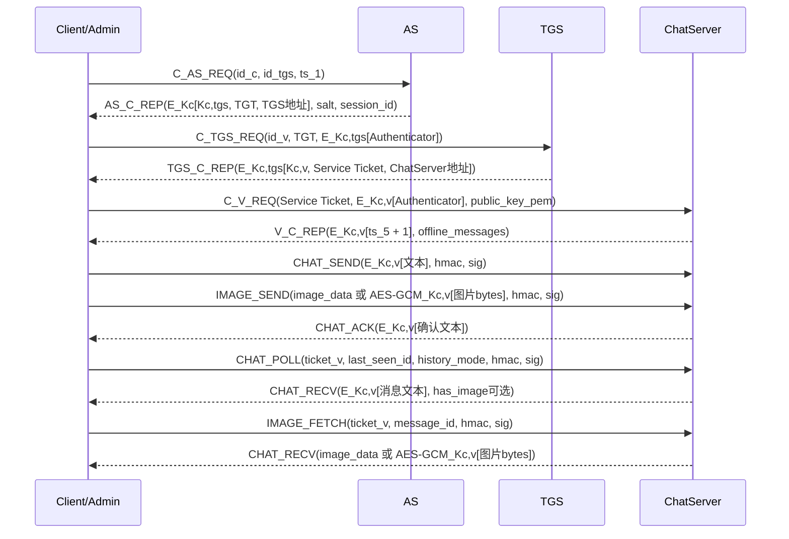

# SafeChat 客户端与服务器通信协议

本文档说明当前版本中客户端、控制台、AS、TGS、ChatServer 的职责，以及各节点之间的报文字段、加密字段和签名方式。

## 1. 节点职责

### 1.1 Client

普通用户客户端负责：

- 输入用户名、密码和 AS 地址。
- 完成 Kerberos V4 风格六步认证。
- 在 `C_V_REQ` 中把本次客户端 RSA 公钥发送给 ChatServer。
- 使用 `Kc,v` 加密文本消息；图片正文是否加密由 `performance.encrypt_images` 配置控制。
- 使用客户端 RSA 私钥对登录后的关键请求签名。
- 拉取群聊、私聊、离线消息和联系人状态。
- 在本地按会话缓存最近消息，切换会话时先显示缓存，再后台拉增量。

### 1.2 Console

控制台也是一个 Kerberos 客户端。它先完成普通登录，然后：

- 向 AS 申请短期 `admin_token`。
- 使用 `Kc,tgs` 加密管理令牌和业务字段后调用 AS/TGS 管理接口。
- 使用 Service Ticket、`Kc,v` 会话和 RSA 签名调用 ChatServer 管理接口。

### 1.3 AS

AS 负责用户认证、TGT 签发、活动会话、IP 封禁和 AS 管理接口。

当前版本中，客户端公钥不发送给 AS，AS 不保存客户端公钥。

### 1.4 TGS

TGS 负责校验 TGT 和 Authenticator，生成 `Kc,v`，签发访问 ChatServer 的 Service Ticket。

### 1.5 ChatServer

ChatServer 负责校验 Service Ticket，完成服务端双向认证，绑定客户端公钥，处理聊天消息、图片消息、在线状态、离线私聊和聊天侧管理操作。

ChatServer 在 `C_V_REQ` 中接收客户端公钥，并绑定到当前 `username + Kc,v` 会话。后续签名校验只信任这个绑定公钥。

ChatServer 对联系人列表使用 1 秒短缓存，并减少 `CHAT_POLL`、`IMAGE_FETCH`、控制台读列表等高频成功读操作的审计写入。

## 2. 公共消息封装

所有网络消息使用 JSON。公共封装字段如下：

| 字段 | 类型 | 说明 |
| --- | --- | --- |
| `v` | int | 协议版本，当前为 `1`。 |
| `type` | string | 消息类型，如 `C_AS_REQ`、`CHAT_SEND`。 |
| `seq` | int | 客户端递增序号。 |
| `sid` | string | 预留会话标识，当前多数消息为空。 |
| `ts` | int | 消息创建时间，毫秒时间戳。 |
| `nonce` | string | 8 字节随机数的 16 位十六进制字符串。 |
| `body` | object | 具体业务报文体。 |
| `hmac` | string | `HMAC-SHA256(Kc,v, canonical_body)`，登录后 ChatServer 业务请求使用。 |
| `sig` | string | 对 `hmac` 的客户端 RSA 签名。 |

示例：

```json
{
  "v": 1,
  "type": "CHAT_SEND",
  "seq": 7,
  "sid": "",
  "ts": 1710000000000,
  "nonce": "0f3a19c4e91b2d77",
  "body": {},
  "hmac": "",
  "sig": ""
}
```

## 3. 加密与签名基础

### 3.1 DES 加密字段

项目使用纯 Python DES-CBC：

- 分组大小：8 字节。
- 填充：PKCS#7。
- IV：随机 8 字节。
- 密钥派生：`DES_key = SHA256(secret)[:8]`。

加密结果统一为：

```json
{
  "ciphertext": "Base64密文",
  "iv": "Base64_IV"
}
```

### 3.2 AES-GCM 图片字段

图片和文件正文属于大字段，不再使用纯 Python DES 加密 Base64 文本。当前版本图片正文固定按 bytes 使用 AES-256-GCM 加密：

```json
{
  "alg": "AES-256-GCM",
  "nonce": "Base64随机数",
  "ciphertext": "Base64密文",
  "tag": "Base64认证标签"
}
```

密钥派生：`AES_key = SHA256(secret)[:32]`。

### 3.3 密码长期密钥

用户长期密钥 `Kc` 不在网络上传输。客户端和 AS 使用同一规则计算：

```text
Kc = SHA256(salt + password)
```

其中 `salt` 由 AS 用户表保存，并通过 `AS_C_REP.body.extensions.salt` 返回给客户端。

### 3.3 票据

票据明文字段：

| 字段 | 说明 |
| --- | --- |
| `id_c` | 用户名。 |
| `ad_c` | 客户端地址。 |
| `k_c_tgs` 或 `k_c_v` | 会话密钥。 |
| `id_tgs` 或 `id_v` | 目标服务 ID。 |
| `ts_2` 或 `ts_4` | 票据签发时间。 |
| `lifetime_2` 或 `lifetime_4` | 票据过期时间。 |

TGT 使用 TGS 服务密钥加密。Service Ticket 使用 ChatServer 服务密钥加密。客户端只能转发票据，不能解密票据内部内容。

### 3.4 Authenticator

Authenticator 明文字段：

| 字段 | 说明 |
| --- | --- |
| `id_c` | 用户名。 |
| `ad_c` | 客户端地址。 |
| `ts_3` 或 `ts_5` | 当前时间戳。 |
| `public_key_fingerprint` | 可选，`C_V_REQ` 中使用的客户端公钥 SHA-256 摘要。 |

访问 TGS 时使用 `Kc,tgs` 加密 Authenticator；访问 ChatServer 时使用 `Kc,v` 加密 Authenticator。

### 3.5 请求摘要与 RSA 签名

登录后的关键请求使用如下流程签名：

1. 对 `body` 按确定性 JSON 序列化：`sort_keys=True`，紧凑分隔符。
2. 计算 `digest = HMAC-SHA256(Kc,v, canonical_body)`。
3. 用客户端 RSA 私钥签名 `digest`。
4. 报文中设置：
   - `hmac = digest`
   - `sig = RSA私钥签名`

ChatServer 验证：

1. 用收到的 `body` 和当前 `Kc,v` 重新计算 HMAC。
2. 比较 HMAC 是否等于 `hmac`。
3. 使用当前 `username + Kc,v` 会话绑定的客户端公钥验证 `sig`。

需要签名的 ChatServer 请求：

- `CHAT_SEND`
- `CHAT_POLL`
- `USER_LIST`
- `IMAGE_SEND`
- `IMAGE_FETCH`
- `ADMIN_MUTE_USER`
- `ADMIN_UNMUTE_USER`
- `ADMIN_KICK_USER`
- `CHAT_ADMIN_LIST_MESSAGES`
- `CHAT_ADMIN_AUDIT_QUERY`
- `CHAT_ADMIN_SET_ROLE`
- `CHAT_ADMIN_DELETE_USER`

## 4. Kerberos 六步认证

### 4.1 C_AS_REQ：Client -> AS

用途：请求 TGT。

`body` 字段：

| 字段 | 说明 |
| --- | --- |
| `id_c` | 用户名。 |
| `id_tgs` | 固定为 `tgs_server`。 |
| `ts_1` | 客户端时间戳。 |
| `extensions.client_type` | `client` 或 `admin_console`。 |

示例：

```json
{
  "type": "C_AS_REQ",
  "body": {
    "id_c": "alice",
    "id_tgs": "tgs_server",
    "ts_1": 1710000000000,
    "extensions": {
      "client_type": "client"
    }
  }
}
```

加密情况：`C_AS_REQ` 本身不加密、不签名。密码不发送给 AS。

AS 处理：

- 检查 IP 是否封禁。
- 查找用户和 salt。
- 检查普通客户端是否已有活跃会话。
- 生成 `Kc,tgs`。
- 签发 TGT。

### 4.2 AS_C_REP：AS -> Client

用途：返回由 `Kc` 加密的 TGT 相关信息。

`body` 字段：

| 字段 | 说明 |
| --- | --- |
| `client_part` | 使用 `Kc` 加密的客户端可读部分。 |
| `extensions.salt` | 用户 salt。 |
| `extensions.session_id` | AS 活动会话 ID。 |
| `extensions.version` | 协议扩展版本。 |
| `extensions.request_id` | 请求 ID。 |

`client_part` 明文：

| 字段 | 说明 |
| --- | --- |
| `k_c_tgs` | Client 与 TGS 的会话密钥。 |
| `id_tgs` | `tgs_server`。 |
| `ad_c` | AS 记录的客户端地址。 |
| `ts_2` | TGT 签发时间。 |
| `lifetime_2` | TGT 过期时间。 |
| `ticket_tgs` | TGT，使用 TGS 服务密钥加密。 |
| `tgs_host` | TGS 对外地址。 |
| `tgs_port` | TGS 对外端口。 |

加密情况：

- `client_part = DES-CBC_Kc(JSON明文)`。
- `ticket_tgs = DES-CBC_Ktgs(JSON票据明文)`。

### 4.3 C_TGS_REQ：Client -> TGS

用途：用 TGT 换取 ChatServer Service Ticket。

`body` 字段：

| 字段 | 说明 |
| --- | --- |
| `id_v` | 固定为 `chat_server`。 |
| `ticket_tgs` | AS 返回的 TGT。 |
| `authenticator_c` | 使用 `Kc,tgs` 加密的 Authenticator。 |

`authenticator_c` 明文：

| 字段 | 说明 |
| --- | --- |
| `id_c` | 用户名。 |
| `ad_c` | TGT 中的客户端地址。 |
| `ts_3` | 当前时间戳。 |

加密情况：

- `ticket_tgs` 已由 AS 使用 TGS 服务密钥加密。
- `authenticator_c = DES-CBC_Kc,tgs(JSON明文)`。
- `C_TGS_REQ` 外层不签名。

TGS 处理：

- 使用 TGS 服务密钥解密 TGT。
- 校验 TGT 有效期。
- 使用 `Kc,tgs` 解密 Authenticator。
- 校验 `id_c` 和地址与 TGT 匹配。
- 生成 `Kc,v`。
- 签发 ChatServer Service Ticket。

### 4.4 TGS_C_REP：TGS -> Client

用途：返回由 `Kc,tgs` 加密的服务票据相关信息。

`body` 字段：

| 字段 | 说明 |
| --- | --- |
| `client_part` | 使用 `Kc,tgs` 加密的客户端可读部分。 |
| `extensions.version` | 协议扩展版本。 |
| `extensions.request_id` | 请求 ID。 |

`client_part` 明文：

| 字段 | 说明 |
| --- | --- |
| `k_c_v` | Client 与 ChatServer 的会话密钥。 |
| `id_v` | `chat_server`。 |
| `ad_c` | 客户端地址。 |
| `ts_4` | Service Ticket 签发时间。 |
| `lifetime_4` | Service Ticket 过期时间。 |
| `ticket_v` | Service Ticket，使用 ChatServer 服务密钥加密。 |
| `chat_host` | ChatServer 对外地址。 |
| `chat_port` | ChatServer 对外端口。 |

加密情况：

- `client_part = DES-CBC_Kc,tgs(JSON明文)`。
- `ticket_v = DES-CBC_Kv(JSON票据明文)`，其中 `Kv` 是 ChatServer 服务密钥。

### 4.5 C_V_REQ：Client -> ChatServer

用途：完成服务端认证，并把客户端 RSA 公钥绑定到当前聊天会话。

`body` 字段：

| 字段 | 说明 |
| --- | --- |
| `ticket_v` | TGS 返回的 Service Ticket。 |
| `authenticator_c` | 使用 `Kc,v` 加密的 Authenticator。 |
| `extensions.session_id` | AS 活动会话 ID，用于心跳和会话治理。 |
| `extensions.public_key_pem` | 客户端本次会话 RSA 公钥。 |

`authenticator_c` 明文：

| 字段 | 说明 |
| --- | --- |
| `id_c` | 用户名。 |
| `ad_c` | Service Ticket 中的客户端地址。 |
| `ts_5` | 当前时间戳。 |
| `public_key_fingerprint` | `SHA256(public_key_pem)`，用于证明认证器和公钥属于同一次认证。 |

加密情况：

- `ticket_v` 已由 TGS 使用 ChatServer 服务密钥加密。
- `authenticator_c = DES-CBC_Kc,v(JSON明文)`。
- `public_key_pem` 不加密，放在 `extensions` 中。

ChatServer 处理：

- 使用 ChatServer 服务密钥解密 `ticket_v`。
- 校验 Service Ticket 有效期。
- 使用 `Kc,v` 解密 Authenticator。
- 校验 `id_c` 和地址。
- 校验 Authenticator 中的 `public_key_fingerprint` 与 `extensions.public_key_pem` 匹配。
- 将 `public_key_pem` 绑定到 `username + Kc,v`。
- 标记用户在线，清除该用户的会话撤销状态。
- 查询离线消息并放入响应扩展。

### 4.6 V_C_REP：ChatServer -> Client

用途：完成双向认证。

`body` 字段：

| 字段 | 说明 |
| --- | --- |
| `client_part` | 使用 `Kc,v` 加密的服务端响应。 |
| `extensions.offline_messages` | 登录时推送的离线消息列表。 |
| `extensions.room` | 默认房间，当前为 `public`。 |

`client_part` 明文：

| 字段 | 说明 |
| --- | --- |
| `ts_5_plus_1` | 客户端 `ts_5 + 1`。 |

加密情况：

- `client_part = DES-CBC_Kc,v({"ts_5_plus_1": ts_5 + 1})`。
- `offline_messages` 中每条消息文本使用 `Kc,v` 加密，字段见第 6 节。

客户端收到后校验 `ts_5_plus_1`，确认 ChatServer 持有 `Kc,v`。

## 5. 登录后聊天协议

### 5.1 CHAT_SEND：Client -> ChatServer

用途：发送文本消息。

`body` 字段：

| 字段 | 说明 |
| --- | --- |
| `ticket_v` | Service Ticket。 |
| `message_cipher` | 使用 `Kc,v` 加密的文本消息。 |
| `chat_type` | `group` 或 `private`。 |
| `recipient` | 私聊接收者；群聊为空。 |

`message_cipher` 明文为用户输入文本。

加密与签名：

- `message_cipher = DES-CBC_Kc,v(text)`。
- `hmac = HMAC-SHA256(Kc,v, canonical_json(body))`。
- `sig = RSA_sign_client_private(hmac)`。

ChatServer 处理：

- 解密 `ticket_v` 得到 `Kc,v` 和用户名。
- 检查会话是否被撤销。
- 使用当前会话绑定公钥验证 `hmac` 和 `sig`。
- 检查发送者是否被禁言。
- 解密 `message_cipher`。
- 群聊或在线私聊直接写入聊天历史。
- 离线私聊同时写入聊天历史和离线队列。

### 5.2 CHAT_ACK：ChatServer -> Client

用途：确认文本或图片发送结果。

`body` 字段：

| 字段 | 说明 |
| --- | --- |
| `sender` | 发送者。 |
| `recipient` | 接收者。 |
| `chat_type` | `group` 或 `private`。 |
| `message_id` | 写入聊天历史后的消息 ID。 |
| `ack_cipher` | 使用 `Kc,v` 加密的确认文本。 |
| `room` | 会话键。 |

加密情况：

- `ack_cipher = DES-CBC_Kc,v(确认文本)`。

### 5.3 IMAGE_SEND：Client -> ChatServer

用途：发送图片消息。

客户端图片处理流程：

1. 读取图片文件。
2. 如果安装 PIL，则自动旋转、缩放到最大 `1280x1280`。
3. 透明图片保存为 PNG；非透明图片保存为 JPEG，质量 75。
4. 压缩后最大允许 10 MB。
5. 为预览生成图片 Base64。
6. 使用 `Kc,v` 对图片 bytes 做 AES-GCM 加密。

`body` 字段：

| 字段 | 说明 |
| --- | --- |
| `ticket_v` | Service Ticket。 |
| `image_cipher` | 必填。使用 `Kc,v` 加密的 AES-GCM 图片密文。 |
| `file_name` | 处理后的文件名。 |
| `file_size` | 压缩后大小，字节。 |
| `original_size` | 原始文件大小，字节。 |
| `chat_type` | `group` 或 `private`。 |
| `recipient` | 私聊接收者；群聊为空。 |

加密与签名：

- `image_cipher = AES-GCM_Kc,v(image_bytes)`。
- `hmac = HMAC-SHA256(Kc,v, canonical_json(body))`。
- `sig = RSA_sign_client_private(hmac)`。

ChatServer 根据请求字段解析图片正文。开启图片加密时，服务端用服务端图片密钥再次 AES-GCM 加密后写入 `chat_messages.image_data`；关闭图片加密时保存 Base64 图片数据。消息文本保存为 `[图片] file_name`。

### 5.4 CHAT_POLL：Client -> ChatServer

用途：增量拉取聊天消息。

`body` 字段：

| 字段 | 说明 |
| --- | --- |
| `ticket_v` | Service Ticket。 |
| `last_seen_id` | 当前会话已看到的最大消息 ID。 |
| `chat_type` | `group` 或 `private`。 |
| `recipient` | 私聊对象；群聊为空。 |
| `limit` | 可选，最多返回条数。当前客户端默认使用 `performance.history_page_size`。 |
| `history_mode` | 可选。`latest` 表示首次进入会话时拉取最近一页历史；普通轮询不设置或为 `incremental`。 |

加密与签名：

- 请求体不额外加密。
- `hmac = HMAC-SHA256(Kc,v, canonical_json(body))`。
- `sig = RSA_sign_client_private(hmac)`。
- ChatServer 使用当前会话绑定公钥验签。

ChatServer 行为：

- `last_seen_id > 0`：只返回该 ID 之后的增量消息。
- `last_seen_id = 0` 且 `history_mode=latest`：返回当前会话最近 `limit` 条历史，并保持按时间正序展示。
- 空轮询和正常成功轮询不写审计日志，降低高频 SQLite 写入。

客户端行为：

- 首次进入某会话且本地无缓存时，使用 `history_mode=latest` 拉最近一页。
- 已有本地会话缓存时，先显示缓存，再用缓存最大消息 ID 拉增量，不再重置游标。

### 5.5 CHAT_RECV：ChatServer -> Client

用途：返回拉取到的消息。

`body` 字段：

| 字段 | 说明 |
| --- | --- |
| `messages` | 消息列表。 |
| `room` | 当前会话键。 |
| `limit` | 本次服务端使用的返回上限。 |
| `history_mode` | `latest` 或 `incremental`。 |

每条消息字段：

| 字段 | 说明 |
| --- | --- |
| `id` | 消息 ID。 |
| `sender` | 发送者。 |
| `recipient` | 接收者。 |
| `chat_type` | `group` 或 `private`。 |
| `timestamp` | 消息创建时间。 |
| `message_cipher` | 使用当前拉取者 `Kc,v` 加密的消息文本。 |
| `hmac` | 原发送请求的摘要。 |
| `sig` | 原发送请求的 RSA 签名。 |
| `pubkey` | 原发送会话绑定的公钥。 |
| `has_image` | 可选，表示该消息包含图片正文。 |
| `file_name` | 可选，图片文件名。 |

加密情况：

- `message_cipher = DES-CBC_当前拉取者Kc,v(message_text)`。
- 图片正文不随 `CHAT_POLL` 返回，客户端后续通过 `IMAGE_FETCH` 单独拉取。

客户端收到后解密 `message_cipher`。如果消息包含图片，先显示图片占位；图片正文加载后再由后台线程生成缩略图。

### 5.6 IMAGE_FETCH：Client -> ChatServer

用途：按消息 ID 拉取图片正文。这样会话切换时 `CHAT_POLL` 不需要加密和传输大图片，聊天记录可以先显示，图片随后异步或按需加载。

请求 `body`：

| 字段 | 说明 |
| --- | --- |
| `ticket_v` | Service Ticket。 |
| `message_id` | 图片消息 ID。 |

加密与签名：

- `hmac = HMAC-SHA256(Kc,v, canonical_json(body))`。
- `sig = RSA_sign_client_private(hmac)`。
- ChatServer 使用当前会话绑定公钥验签。

响应 `body`：

| 字段 | 说明 |
| --- | --- |
| `message_id` | 图片消息 ID。 |
| `image_cipher` | 使用当前请求者 `Kc,v` 加密的 AES-GCM 图片密文。 |
| `file_name` | 图片文件名。 |

加密情况：

- `image_cipher = AES-GCM_当前请求者Kc,v(image_bytes)`。

客户端行为：

- 历史图片默认只显示占位，点击图片时才拉取并解密，避免切换会话时批量解密。

### 5.7 USER_LIST：Client -> ChatServer

用途：拉取联系人和在线状态。

请求 `body`：

| 字段 | 说明 |
| --- | --- |
| `ticket_v` | Service Ticket。 |

加密与签名：

- `hmac = HMAC-SHA256(Kc,v, canonical_json(body))`。
- `sig = RSA_sign_client_private(hmac)`。
- ChatServer 使用当前会话绑定公钥验签。

响应 `body`：

| 字段 | 说明 |
| --- | --- |
| `users` | 联系人列表。 |
| `count` | 联系人数。 |

联系人包含用户名、角色、在线状态、IP、最后在线时间、禁言信息等字段，具体取决于 ChatServer 当前联系人查询结果。

性能说明：

- ChatServer 对 `USER_LIST` 使用 1 秒内存短缓存。
- 用户登录、首次活跃、在线超时、禁言/解禁、踢人、改角色、删除用户、会话撤销等状态变化会立即清空缓存。
- 正常成功的 `USER_LIST` 不写审计日志；签名失败仍写安全审计。

## 6. 离线消息

离线私聊发生在 `CHAT_SEND.chat_type = private` 且接收者不在线时。

ChatServer 处理方式：

- 写入 `chat_messages`，保证发送者切换会话后仍可看到。
- 写入离线消息队列，等待接收者下次 `C_V_REQ` 成功后推送。

`V_C_REP.body.extensions.offline_messages` 中每条离线消息字段：

| 字段 | 说明 |
| --- | --- |
| `id` | 离线消息 ID。 |
| `sender` | 发送者。 |
| `message_cipher` | 使用接收者当前 `Kc,v` 加密的消息文本密文。 |
| `iv` | `message_cipher` 对应 IV。 |
| `chat_type` | `private`。 |
| `created_at` | 原消息创建时间。 |

加密情况：

- `message_cipher` 和 `iv` 等价于 `DES-CBC_接收者Kc,v(plaintext)` 的两个字段，只是为了兼容客户端历史结构拆开放置。

## 7. 会话心跳

### 7.1 AS_SESSION_HEARTBEAT：Client -> AS

用途：保持 AS 活动会话 `last_seen`，用于重复登录检测。

`body` 字段：

| 字段 | 说明 |
| --- | --- |
| `username` | 当前用户名。 |
| `extensions.session_id` | AS 登录时返回的会话 ID。 |

AS 校验用户名、session ID 和客户端地址后更新会话时间。

### 7.2 AS_SESSION_HEARTBEAT_ACK：AS -> Client

`body` 字段：

| 字段 | 说明 |
| --- | --- |
| `ok` | `true` 表示更新成功。 |

## 8. 管理协议

### 8.1 AS 管理接口

控制台先用 `AS_ADMIN_TOKEN_REQ` 获取 `admin_token`。

`AS_ADMIN_TOKEN_REQ.body`：

| 字段 | 说明 |
| --- | --- |
| `ticket_tgs` | 登录阶段得到的 TGT。 |
| `authenticator_c` | 使用 `Kc,tgs` 加密的 Authenticator。 |

响应 `AS_ADMIN_ACK.body`：

| 字段 | 说明 |
| --- | --- |
| `admin_token` | AS 签发的短期管理员令牌。 |
| `expires_in` | 有效期秒数，当前为 3600。 |

后续 AS/TGS 管理请求不携带明文 `admin_token` 或业务字段。客户端使用 TGT 中的 `Kc,tgs` 构造统一加密请求：

| `body` 字段 | 说明 |
| --- | --- |
| `ticket_tgs` | AS 签发给客户端的 TGT，服务端用 TGS 服务密钥解密。 |
| `authenticator_c` | `DES-CBC_Kc,tgs(Authenticator)`，用于证明请求者持有 `Kc,tgs`。 |
| `admin_cipher` | `DES-CBC_Kc,tgs(JSON)`，密文内包含 `admin_token`、`action_type`、`fields`、`ts`。 |

`admin_cipher` 明文结构：

```json
{
  "admin_token": "AS 签发的短期管理员令牌",
  "action_type": "AS_ADMIN_CREATE_USER",
  "fields": {
    "username": "new_user",
    "password": "初始密码",
    "role": "user"
  },
  "ts": 1710000000000
}
```

服务端会校验 TGT、Authenticator、密文动作类型、`admin_token`，并要求令牌用户与 TGT 用户一致。旧版 `body.admin_token + 明文字段` 管理请求会被拒绝。

| 消息类型 | 主要字段 | 说明 |
| --- | --- | --- |
| `AS_ADMIN_LIST_USERS` | `fields={}` | 列出用户。 |
| `AS_ADMIN_CREATE_USER` | `fields.username`, `fields.password`, `fields.role` | 创建用户。 |
| `AS_ADMIN_DELETE_USER` | `fields.target_username` | 删除用户。 |
| `AS_ADMIN_SET_ROLE` | `fields.target_username`, `fields.role` | 设置角色。 |
| `AS_ADMIN_RESET_PASSWORD` | `fields.target_username`, `fields.password` | 重置密码。 |
| `AS_ADMIN_LIST_SESSIONS` | `fields={}` | 查看活动会话。 |
| `AS_ADMIN_INVALIDATE_USER` | `fields.target_username` | 使用户 AS 会话失效。 |
| `AS_ADMIN_BAN_IP` | `fields.ip_address`, `fields.reason`, `fields.ban_seconds` | 封禁 IP。 |
| `AS_ADMIN_UNBAN_IP` | `fields.ip_address` | 解除 IP 封禁。 |
| `AS_ADMIN_LIST_IP_BANS` | `fields={}` | 查看 IP 封禁列表。 |
| `AS_ADMIN_AUDIT_QUERY` | `fields.action_filter`, `fields.limit` | 查询 AS 审计。 |

AS/TGS 管理接口依赖加密的 `admin_token` 与 `Kc,tgs` 认证器，不使用客户端 RSA 签名。

### 8.2 TGS 管理接口

| 消息类型 | 主要字段 | 说明 |
| --- | --- | --- |
| `TGS_ADMIN_AUDIT_QUERY` | `fields.action_filter`, `fields.limit` | 查询 TGS 审计。 |

响应类型为 `TGS_ADMIN_ACK`。

### 8.3 ChatServer 管理接口

ChatServer 管理接口使用 Service Ticket 和客户端签名，不使用 `admin_token`。

公共规则：

- `body.ticket_v` 必须存在。
- 请求必须包含 `hmac` 和 `sig`。
- ChatServer 使用当前会话绑定公钥验签。
- ChatServer 再检查发送者在本地角色副本中是否为 `admin`。

| 消息类型 | 主要字段 | 说明 |
| --- | --- | --- |
| `ADMIN_MUTE_USER` | `ticket_v`, `target_username`, `duration_seconds`, `reason` | 禁言用户。 |
| `ADMIN_UNMUTE_USER` | `ticket_v`, `target_username` | 解除禁言。 |
| `ADMIN_KICK_USER` | `ticket_v`, `target_username` | 踢出并撤销聊天会话。 |
| `CHAT_ADMIN_LIST_MESSAGES` | `ticket_v`, `chat_type`, `user_filter`, `limit` | 查询聊天记录。 |
| `CHAT_ADMIN_AUDIT_QUERY` | `ticket_v`, `action_filter`, `limit` | 查询 ChatServer 审计。 |
| `CHAT_ADMIN_SET_ROLE` | `ticket_v`, `target_username`, `role` | 同步角色副本。 |
| `CHAT_ADMIN_DELETE_USER` | `ticket_v`, `target_username` | 删除 ChatServer 本地用户副本。 |

响应类型根据操作不同为 `ADMIN_MUTE_ACK`、`ADMIN_UNMUTE_ACK`、`ADMIN_KICK_ACK` 或 `CHAT_ADMIN_ACK`。

## 9. 错误响应

错误统一使用：

```json
{
  "type": "ERROR",
  "body": {
    "error": "中文错误提示",
    "code": "可选错误码"
  }
}
```

常见错误：

- 用户名或密码错误。
- 当前 IP 已被封禁。
- 用户已在其他主机登录。
- TGT 或 Service Ticket 已过期。
- 认证器用户或地址与票据不匹配。
- 缺少客户端公钥。
- 签名验证失败。
- 会话已被管理员撤销。
- 需要管理员权限。

## 10. 性能与缓存策略

### 10.1 客户端会话缓存

客户端为每个会话保留最近 `performance.history_page_size` 条已解密消息。

- 切换到已有缓存的会话时，客户端立即渲染缓存。
- 随后用缓存中的最大消息 ID 恢复增量游标，并后台拉取新消息。
- 只有首次进入某个没有缓存的会话时，才请求 `history_mode=latest` 的最近历史页。
- 缓存仅存在于客户端进程内，客户端重启后会重新加载最近历史页。

### 10.2 图片加载策略

- 图片正文使用 AES-GCM 加密，历史图片默认按需点击加载，避免切换会话时批量传输。

### 10.3 ChatServer 高频请求优化

- `USER_LIST` 使用 1 秒内存缓存。
- `CHAT_POLL`、`IMAGE_FETCH`、`CHAT_ADMIN_LIST_MESSAGES` 等正常成功读操作不逐条写审计日志。
- 签名失败、权限失败、会话撤销、管理写操作、普通消息写入仍保留审计。

## 11. 通信时序总览


